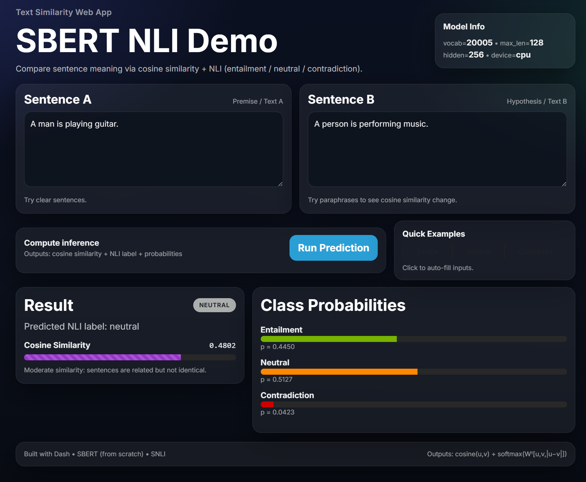

# 🧠 SBERT NLI Demo (SNLI)

**Sentence‑BERT (from scratch) + Natural Language Inference + Dash Web Application**

This project implements a complete NLP pipeline:

1. Train **BERT from scratch** using Masked Language Modeling (MLM)
2. Fine‑tune as **Sentence‑BERT (SBERT)** with a Siamese architecture
3. Perform **Natural Language Inference (NLI)**
4. Deploy an interactive **Dash web application**

---
## ✅ Model Architecture

### MiniBERT Encoder (Task 1)
- Token embedding + positional embedding
- Transformer encoder blocks
- Hidden size: **256**
- Max sequence length: **128**
- Vocabulary size: **~20k**
- Training objective: **Masked Language Modeling (MLM)**

### SBERT Siamese Network (Task 2)

Two sentences share the same encoder:

```
u = encoder(sentence A)
v = encoder(sentence B)

feature = [u, v, |u − v|]
output = Softmax(Wᵀ · feature)
```

Pooling method:
- Mean pooling over token embeddings

NLI Classes:
- entailment
- neutral
- contradiction

---

## 📁 Project Structure

```
A4-DO-YOU-AGREE/
│
├── app/
│   └── app.py                # Dash web application
│
├── artifacts/
│   ├── BERT_scratch.pt       # MLM pretrained encoder
│   └── SBERT_nli.pt          # SBERT trained model
│
├── notebooks/
│   └── st126130_notebook_A4.ipynb
│
├── sample.png                # App screenshot
├── README.md
├── requirements.txt
└── .gitignore
```

---

## ⚙️ Installation

### 1. (Optional) Create virtual environment

```bash
python -m venv venv
```

Activate:

**macOS / Linux**
```bash
source venv/bin/activate
```

**Windows**
```bash
venv\Scripts\activate
```

### 2. Install dependencies

```bash
pip install -r requirements.txt
```

Required packages:
- torch
- numpy
- dash
- dash-bootstrap-components
- datasets
- tqdm
- scikit-learn

---

## ▶️ Running the Web Application

From project root:

```bash
python app/app.py
```

You should see:

```
Dash is running on http://127.0.0.1:8050/
```

Open browser:

👉 http://127.0.0.1:8050/

---

## 🧪 How to Use the Web Interface

1. Enter **Sentence A** and **Sentence B**
2. Click **Run Prediction**
3. Outputs:
   - Predicted NLI label
   - Cosine similarity
   - Class probability bars

Example:

```
Sentence A: A man is playing guitar.
Sentence B: A person is performing music.
Prediction: neutral
Cosine similarity ≈ 0.48
```

---
## 🚀 Demo



---
## 🧾 Dataset

| Dataset | Purpose |
|---|---|
| WikiText‑2 | MLM pretraining |
| SNLI | NLI fine‑tuning |

Datasets loaded via HuggingFace `datasets`.

---

## 📊 Evaluation (Task 3)

The notebook includes:

- Classification report
- Accuracy metrics
- Confusion matrix
- Analysis and discussion

Accuracy achieved:

**0.6165 (SNLI subset)**

---

## 💾 Model Checkpoints

`artifacts/` contains:

- **BERT_scratch.pt**
  - Encoder pretrained via MLM
- **SBERT_nli.pt**
  - Siamese SBERT weights
  - Classifier head
  - Vocabulary + config

---

## ✅ Assignment Tasks Covered

- **Task 1:** Train BERT from scratch
- **Task 2:** Implement Sentence‑BERT
- **Task 3:** Evaluation & analysis
- **Task 4:** Dash deployment

---

## 👤 Author

- Student Name: Aphisit Jaemyaem
- Student ID: **st126130**
- Course: Natural Language Processing

---

## 📜 License

Educational use only.
